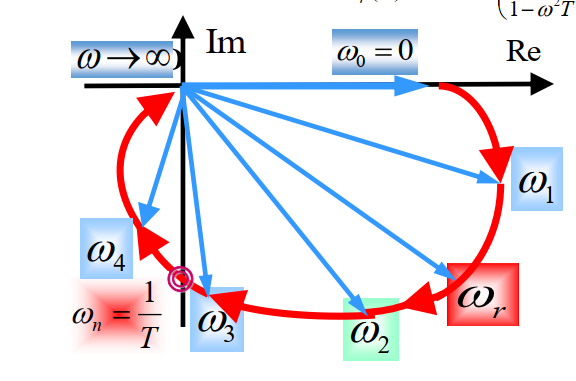

# 自动控制理论第五章

## 频率特性
*正弦信号下系统**稳态响应**随频率变化性能*

### 描述频率特性三种图形形式
1. 对数频率特性（伯德图）\
   ***(横坐标$\omega$单位距离十倍变化)***
   * 对数幅频特性$L(\omega)=20lgA(\omega)$ 
   * 对数相频特性$\phi(\omega)$
2. 幅相频率特性（极坐标图或奈奎斯特图）\
   系统频率特性 ***(取逆时针为相角正方向)***
   $$G(j\omega)=A(\omega)e^{j\phi(\omega)}$$
   极坐标图即为$\omega$变化时，向量端点描绘曲线
   
3. 对数幅相图(了解)
   

### 典型环节频率特性
**抓住低频、高频、转折点**
1. 比例环节
   $$
   G(j\omega)=K  \\
   L(\omega)=20\lg K \quad \varphi(\omega) =0
   $$
2. 积分环节
   $$
   G(j\omega)=\frac{1}{j\omega} \\
   L(\omega)=-20 \lg \omega \quad \varphi(\omega)=-\frac{\pi}{2}
   $$
   * 波特图
     
   * 极坐标图
     
3. 惯性环节
   $$
   G(j\omega)=\frac{1}{1+j\omega T} \\
   L(\omega)=-10 \lg (1+\omega^2 T^2) \quad \varphi(\omega)=-atan(\omega T)
   $$
   * 波特图
     
   * 极坐标图
     
4. 振荡环节
   $$
   G(j\omega)=\frac{1}{(j\omega T)^2+2\zeta(j\omega T)+1} \\
   L(\omega)=-10\lg ((1-\omega^2 T^2)^2+(2\zeta \omega T)^2) \quad \varphi(\omega)=-atan(\frac{2\zeta \omega T}{1-\omega^2 T^2})
   $$
   * 波特图
      当$\omega \gg 1$时，忽略低次项 \
      $L(\omega)=-40 \lg(\omega T)$
      
      峰值$\omega_r=\frac{1}{T}\sqrt{1-2\zeta^2}$
   * 极坐标图
      
5. 微分环节
   
   互为倒数的传递函数间关系
   $$
   L_1(\omega)=-L_2(\omega) \\
   \varphi_1(\omega)=-\varphi_2(\omega)
   $$
   * 极坐标图
   
6. 延迟环节
   $$
   G(j\omega)=e^{-j\omega T} \\
   $$

## 开环频率特性曲线
**拆成多个典型环节后叠加绘制**